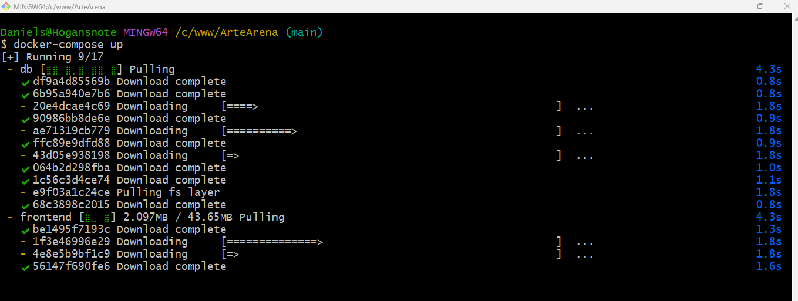
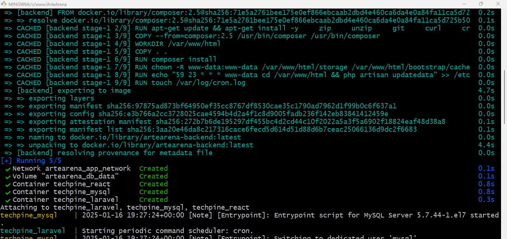
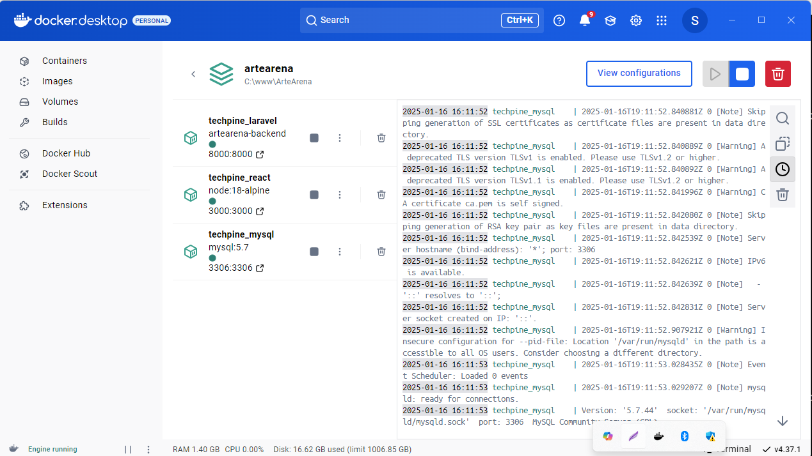

# TESTE para vaga na Emrpesa Arte Arena

> [!NOTE]
> Arquivo PDF explicando o [teste:](Teste_para_Desenvolvedor_FullStack.pdf)

**Programador:** Daniel Santos
 
> [!NOTE]
> tecnologias:
> * Laravel (backend)
> * Mysql (banco de dados)
> * ReactJs (frontend)
> * Docker (container)


Para visualizar o teste. realize o clone do repositório:
````
git clone https://github.com/squaldaniel/Teste_Arte_Areba.git
````
Dividimo o projeto em back e front, na pasta backend está a aplicação com laravel. no arquivo .env há algumas informações que precisam estar especificas no .env para que funcionem perfeitamente, como a url do projeto, a url do front, para permitir o **CORS**. por isso aconselhamos a cópia do proprio _.env.example_ para ser ser arquivo **.env**.
Ao acessar a pasta clonada via prompt de comando, e estando o docker e docker compose instalado em seu computador, rode o comando:
````
docker-compose up
````

Aguarde o Docker carregar a imagem e deposi acesso o backend na url localhost:8000 e frontend na porta localhost:3000.


> [!IMPORTANT]
> Achamos que ao invês do job, que é uma ação que precisa de outra para que ocorra, seria mais prático criar uma comando do Artisan que realiza a atualização e agendarmos o mesmo na cron da imagem linux. Então ao subir a imagem já é criado um tarefa para _todo dias_ as **23:59**.

Docker-compose conm os container rodando:


> [!CAUTION]
> Na descrição do teste é solicitado a documentação com 